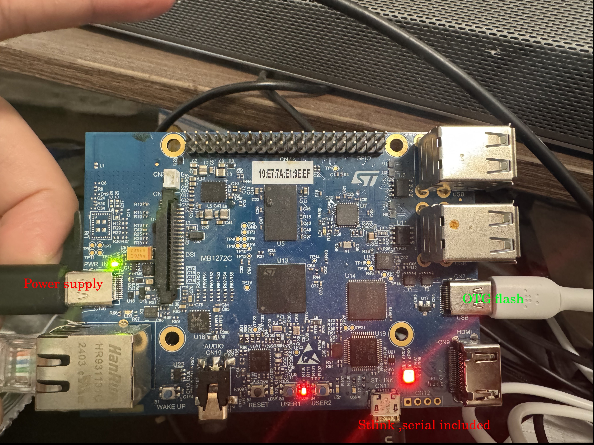

# STM32MP157d-DK1
## Get start

Flash:
+ Download STM32CubeProgrammer and flash package from ST homepage.        
+ Unzip the flash packge.
+ Go to the directory contains the images and layout
+ swith 2 boot switchs to off      
+ Connect OTG to host PC
+ connect Powersupply
+ press reset
+ flash the board with a corresponding layout with command
  +  ```STM32_Programmer_CLI -c port=usb1 -w flashlayout_st-image-weston/optee/FlashLayout_sdcard_stm32mp157d-dk1-optee.tsv```
+  wait for finish

Boot:
+ swith 2 boot switchs to on
+ connect to serial output with command like
  + ```minicom -D /dev/ttyACM0```
+ press reset